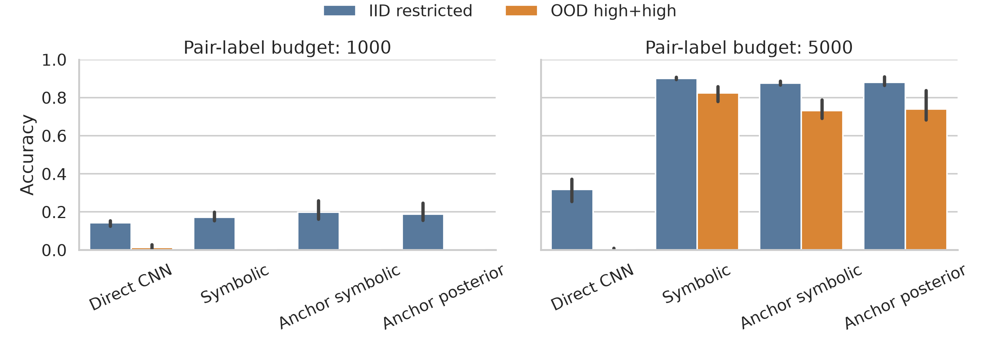
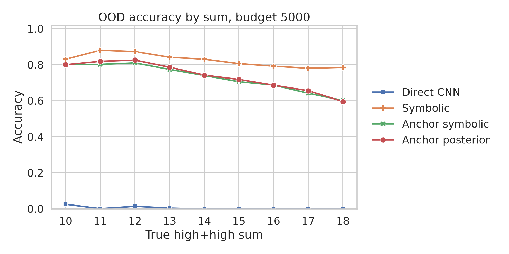
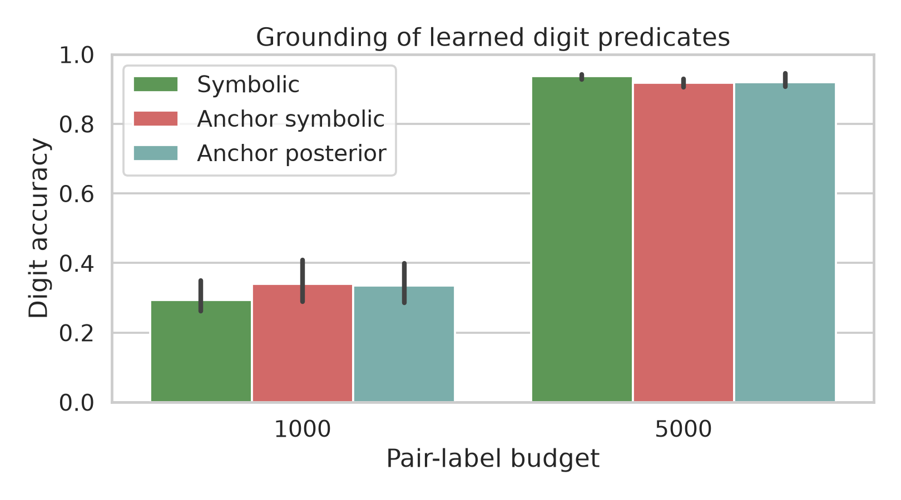

# Neural-Symbolic Learning Research Report

## 1. Executive Summary

This study tested whether neural-symbolic learning improves systematic generalization on an AddMNIST task where training excludes all high-plus-high digit pairs. The key finding is that symbolic composition is decisive once enough weak pair labels are available: with 5,000 pair labels, a plain neural-symbolic sum-likelihood model reached 82.5% OOD high-plus-high accuracy, while a direct pair CNN reached 0.3%.

The proposed anchor-posterior variant was useful as an ablation but did not beat the simpler symbolic likelihood model. The strongest practical implication is that exact symbolic marginalization over learned digit predicates can extrapolate to output labels never observed during training, whereas a direct classifier over sum labels cannot.

## 2. Research Question & Hypothesis

**Question:** Can a compact neural-symbolic AddMNIST learner generalize to digit-pair sums never observed as training labels?

**Hypothesis:** A model that learns digit perception but computes sums through a fixed symbolic addition table should outperform a direct neural sum classifier on high-plus-high digit pairs, especially for sums 14-18 that are absent from training.

## 3. Literature Review Summary

The resource review identified DeepProbLog, A-NeSI, Scallop, LTNtorch, Neural Logic Machines, and related systems as key neural-symbolic baselines. The shared lesson is that neural predicates plus symbolic inference can improve data efficiency and compositional generalization, but many reproduction stacks are heavy or dependency-fragile.

This experiment used MNIST/AddMNIST because it is a standard neural-symbolic benchmark in DeepProbLog, A-NeSI, and Scallop-style work, while remaining small enough for a fully automated run. The designed gap was explicit OOD label extrapolation: not merely learning addition in-distribution, but predicting valid sums that never appeared as supervised labels.

## 4. Methodology

### Data

- Dataset: local MNIST from `datasets/mnist/`.
- Train split: 60,000 digit images.
- Test split: 10,000 digit images.
- Pair task: given two digit images, predict their sum in `{0, ..., 18}`.
- Training restriction: exclude pairs where both digits are 5-9.
- OOD split: include only pairs where both digits are 5-9.
- Consequence: sums 14-18 are never observed as training labels, but are common in OOD high-plus-high evaluation.

### Models

- `direct_sum`: pure neural CNN over two image channels, trained with cross-entropy over sum labels.
- `symbolic_sum`: shared digit CNN; pair-sum likelihood is computed by exact marginalization over all digit pairs satisfying `a + b = sum`.
- `anchor_symbolic`: `symbolic_sum` plus 10 labeled digit anchors per class.
- `anchor_posterior`: `anchor_symbolic` plus posterior entropy regularization over latent digit-pair assignments.

### Protocol

- Pair-label budgets: 1,000 and 5,000.
- Seeds: 11, 23, 37.
- Epochs: 15.
- Batch size: 512.
- Optimizer: AdamW, learning rate 1e-3, weight decay 1e-4.
- Evaluation: 4,000 IID restricted pairs and 4,000 OOD high-plus-high pairs per run.
- Statistical tests: paired seed-level t-tests for OOD accuracy, with Cohen's dz effect sizes; bootstrap 95% CIs over per-example predictions.

### Environment

- Python: 3.12.8.
- PyTorch: 2.12.1+cu130.
- TorchVision: 0.27.1+cu130.
- GPU: NVIDIA RTX A6000, 47.4 GB; 4 GPUs detected, experiment used `cuda:0`.
- Mixed precision: enabled.
- Full metadata: `results/addmnist/metadata.json`.

## 5. Results



| Budget | Method | IID acc (%) | OOD high+high acc (%) |
| ------ | ------ | ----------- | --------------------- |
| 1000 | direct_sum | 14.3 | 1.4 |
| 1000 | symbolic_sum | 17.3 | 0.0 |
| 1000 | anchor_symbolic | 19.9 | 0.0 |
| 1000 | anchor_posterior | 18.9 | 0.0 |
| 5000 | direct_sum | 31.8 | 0.3 |
| 5000 | symbolic_sum | 90.0 | 82.5 |
| 5000 | anchor_symbolic | 87.7 | 73.2 |
| 5000 | anchor_posterior | 88.0 | 74.1 |

At 1,000 pair labels, no symbolic method learned a stable enough digit grounding to solve high-plus-high OOD pairs. At 5,000 pair labels, the neural-symbolic methods sharply separated from the direct CNN. The plain symbolic likelihood was strongest, reaching 90.0% IID accuracy and 82.5% OOD accuracy.

### Unseen Label Extrapolation

For budget 5,000, OOD accuracy split by whether the sum label was seen during training:

| Method | OOD sum region | Accuracy (%) | Examples |
| ------ | -------------- | ------------ | -------- |
| direct_sum | seen sums 10-13 | 0.9 | 4,432 |
| symbolic_sum | seen sums 10-13 | 85.7 | 4,432 |
| anchor_symbolic | seen sums 10-13 | 79.2 | 4,432 |
| anchor_posterior | seen sums 10-13 | 80.6 | 4,432 |
| direct_sum | unseen sums 14-18 | 0.0 | 7,568 |
| symbolic_sum | unseen sums 14-18 | 80.6 | 7,568 |
| anchor_symbolic | unseen sums 14-18 | 69.7 | 7,568 |
| anchor_posterior | unseen sums 14-18 | 70.3 | 7,568 |



### Digit Grounding



| Method | Budget | Digit acc mean (%) | Digit acc std (%) | Runs |
| ------ | ------ | ------------------ | ----------------- | ---- |
| symbolic_sum | 1000 | 29.4 | 4.8 | 3 |
| anchor_symbolic | 1000 | 34.1 | 6.1 | 3 |
| anchor_posterior | 1000 | 33.4 | 5.9 | 3 |
| symbolic_sum | 5000 | 93.8 | 0.8 | 3 |
| anchor_symbolic | 5000 | 91.8 | 1.1 | 3 |
| anchor_posterior | 5000 | 92.0 | 2.2 | 3 |

The strong 5,000-label OOD result coincided with high digit grounding accuracy. This supports the interpretation that the model learned reusable digit predicates rather than a shortcut over pair labels.

### Statistical Summary

For budget 5,000 OOD high-plus-high accuracy:

| Method A | Method B | Mean A (%) | Mean B (%) | Diff (%) | Cohen dz | p-value | Seeds |
| -------- | -------- | ---------- | ---------- | -------- | -------- | ------- | ----- |
| anchor_posterior | direct_sum | 74.1 | 0.3 | 73.8 | 9.33 | 0.0038 | 3 |
| anchor_symbolic | direct_sum | 73.2 | 0.3 | 72.9 | 16.67 | 0.0012 | 3 |
| symbolic_sum | direct_sum | 82.5 | 0.3 | 82.2 | 20.75 | 0.0008 | 3 |

Bootstrap 95% CI for 5,000-label OOD accuracy:

- `symbolic_sum`: 81.8% to 83.2%.
- `anchor_symbolic`: 72.4% to 74.0%.
- `anchor_posterior`: 73.3% to 74.8%.
- `direct_sum`: 0.2% to 0.4%.

Raw outputs are saved in `results/addmnist/predictions.csv`; aggregate tables are in `results/addmnist/summary_pair_metrics.csv`, `results/addmnist/summary_digit_metrics.csv`, `results/addmnist/statistical_tests.csv`, and `results/addmnist/ood_sum_region_summary.csv`.

## 6. Analysis & Discussion

The experiment supports the broader neural-symbolic hypothesis: symbolic structure enabled label extrapolation that a direct classifier did not achieve. The direct CNN had no training examples for sums 14-18 and learned a distribution-bound mapping from image pairs to observed labels. In contrast, `symbolic_sum` learned digit predicates and used the addition table to produce valid labels outside the supervised label support.

The most important negative result is that the planned anchor-posterior modification was not the best method. At 5,000 pair labels, weak sum-likelihood alone achieved the highest digit accuracy and OOD sum accuracy. The anchor and entropy terms may have over-constrained early latent assignments or over-weighted the small anchor set relative to the pair-label signal.

The 1,000-label condition is also informative. All methods performed poorly on OOD high-plus-high pairs, showing that symbolic structure is not magic: the perception predicates must be learned well enough before symbolic composition helps.

## 7. Limitations & Threats to Validity

- MNIST/AddMNIST is synthetic and much simpler than language, visual QA, or knowledge-graph neural-symbolic reasoning.
- The direct CNN baseline is structurally disadvantaged for labels absent from training; this is intentional for the extrapolation test, but it should not be interpreted as a universal neural baseline failure.
- Only three seeds were run. The effects at budget 5,000 are large and consistent, but p-values are exploratory.
- Hyperparameters were not exhaustively tuned. The anchor-posterior method might improve with a different anchor weight, entropy coefficient, schedule, or stronger augmentation.
- The symbolic rule was known and exact. This does not test learned rule induction.
- OOD pairs use the same MNIST test distribution, so the experiment tests compositional label extrapolation, not visual domain shift.

## 8. Reproducibility & Validation

Code:

- `src/addmnist_experiment.py`
- `src/analyze_results.py`

Run commands:

```bash
source .venv/bin/activate
python src/addmnist_experiment.py --output-dir results/addmnist --budgets 1000 5000 --seeds 11 23 37 --epochs 15 --batch-size 512 --eval-pairs 4000
python src/analyze_results.py --results-dir results/addmnist --figures-dir figures
```

Validation performed:

- `python -m py_compile src/addmnist_experiment.py src/analyze_results.py` passed.
- Same-seed deterministic rerun produced identical metrics and predictions in `results/repro_a/` and `results/repro_b/`, ignoring expected runtime differences.
- Results contain 66 metric rows and 192,000 per-example predictions.
- Random seeds are set for Python, NumPy, and PyTorch; deterministic cuDNN settings are enabled.

## 9. Conclusions & Next Steps

The clear answer is that neural-symbolic learning can produce strong systematic generalization in this controlled AddMNIST setting, but only after the neural predicates are sufficiently grounded. The simplest symbolic likelihood model was the strongest method, achieving 80.6% accuracy on sums 14-18 that never appeared as training labels.

Recommended follow-up experiments:

1. Tune anchor and posterior schedules rather than applying them uniformly from the first epoch.
2. Extend the same protocol to three-digit arithmetic where exact symbolic marginalization becomes more expensive.
3. Compare against Scallop or DeepProbLog implementations once dependency modernization is complete.
4. Add noisy or shifted MNIST variants to test whether symbolic composition remains robust under perceptual domain shift.

## References

- Manhaeve et al., "DeepProbLog: Neural Probabilistic Logic Programming", NeurIPS 2018. Local PDF: `papers/1805.10872_deepproblog_neural_probabilistic_logic_programming.pdf`.
- van Krieken et al., "A-NeSI: A Scalable Approximate Method for Probabilistic Neurosymbolic Inference", 2023. Local PDF: `papers/2212.12393_a_nesi_approximate_neurosymbolic_inference.pdf`.
- Li, Huang, and Naik, "Scallop: A Language for Neurosymbolic Programming", 2023. Local PDF: `papers/2304.04812_scallop_language_for_neurosymbolic_programming.pdf`.
- Carraro et al., "LTNtorch: PyTorch Logic Tensor Networks", 2024. Local PDF: `papers/2409.16045_ltntorch_pytorch_logic_tensor_networks.pdf`.
- LeCun et al., MNIST dataset, local copy in `datasets/mnist/`.
